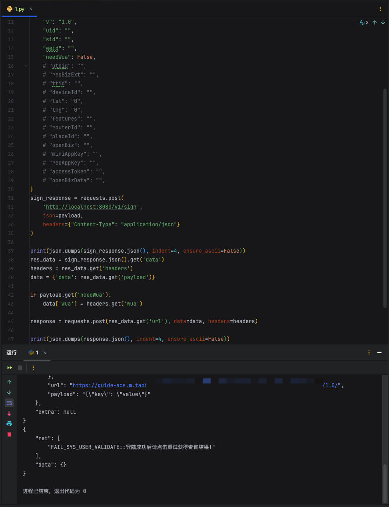

# 淘宝加密算法
支持各种语言的调用(易语言, Java, Python, Go, C++...)
## [Contact Telegram](https://t.me/x_mini_wua)

# x-sign, x-mini-wua, x-sgext, wua
* **纯算法, 不使用unidbg**
* 支持自定义设备信息

python代码
``` python
import json
import requests

request_payload = {
    'key': 'value',
}

payload = {
    "payload": json.dumps(request_payload),
    "api": "",
    "v": "1.0",
    "uid": "",
    "sid": "",
    "eeid": "",
    "needWua": False,
    # "utdid": "",
    # "reqBizExt": "",
    # "ttid": "",
    # "deviceId": "",
    # "lat": "0",
    # "lng": "0",
    # "features": "",
    # "routerId": "",
    # "placeId": "",
    # "openBiz": "",
    # "miniAppKey": "",
    # "reqAppKey": "",
    # "accessToken": "",
    # "openBizData": "",
}
sign_response = requests.post(
    'http://localhost:8080/v1/sign',
    json=payload,
    headers={"Content-Type": "application/json"}
)

print(json.dumps(sign_response.json(), indent=4, ensure_ascii=False))
res_data = sign_response.json().get('data')
headers = res_data.get('headers')
data = {'data': res_data.get('payload')}

if payload.get('needWua'):
    data['wua'] = headers.get('wua')

response = requests.post(res_data.get('url'), data=data, headers=headers)

print(json.dumps(response.json(), indent=4, ensure_ascii=False))

```


返回响应
``` json
{
    "wua": "FKr2_w2Q1gQWp44G1QVIEQoXevWP6jvWgIcwSCoAbXbQk/oi84PdGP3MTrwGM8fLJdSFPVmO2QljqedbWhs2NxpmxGGeyMeYHpYoGLnfK/2EAOfE77zpPm4ixFbmnw7jOFLwoMcC+xhbzEFV+iAdjEesTN+hdbdPV+KswzV0Z1RQjdGPUFJb2Yk3E8nye8yHnTqFZALIGxAXtxtbQkSXWQcpayMvFfzOnizaBiP6q7F67h0BNu0A1Hf5+tp/WQGv5CW489rZtI3uM9GOgTpJlveW8s8lM7sfTIHaQTfDBnmKq78yoC0jPyDyzJvsZjqM9pvw/lhZQ3K+aETNMC2MgDRnWqV5", 
    "x-mini-wua": "ahgQcwT1vIwVaIKDIaPlssm4U+bZW5yjsGPT9d99vqoHYR0qm63Bh6ttlpRtSE07856xEzqT98ifcOKWiYnfSIT/hIwcnnU5XtK6mxRyKvjr5ycMqTDImp4UfD98V40blBlluoRhVbMWnLx4CvhnsZQ/RXncFsL0j/beS3W0ikt3ongBGqnrStO/0", 
    "x-sgext": "JAGe8ZHWeUwwK/Ar8CvwLTfjG7zv3B+Jf4waQU50/Gu0q/q7Sr9Kv0qS9wL3Sr8C+QrGr8ivwafGpsBrsGu0simyfqS+Miq0q3/Sr9Kv0q/7SrtKuwbSrg==", 
    "x-sign": "azYBCM005xAAI6aC3/CoFa+MOZ4xdZOVvDp7D4B/0QZAIlElgytofx/p3/VOr06aDq9Orw65RdIL06Y+HC78oHv3HvKcCXLJGr4Iev"
}
```


# 调用效果

